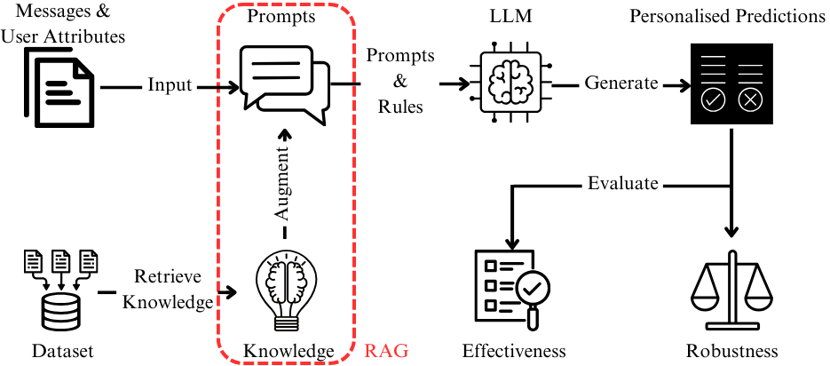

# ICNLSP 2024: Personalised Abusive Language Detection Using LLMs and Retrieval Augmented Generation

**Note 1:** The 7th International Conference on Natural Language and Speech Processing has accepted this work [link](https://aclanthology.org/2024.icnlsp-1.11/). **Note 2:** Our experiments use a simulator as a preliminary study to assess the feasibility of the proposed solution. The input is replaced with test data, and the RAG component is simplified by embedding hand-selected rules into prompts.
