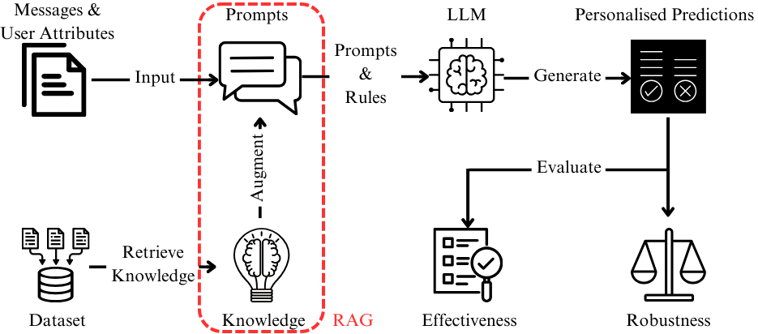

# ICNLSP: Personalised Abusive Language Detection Using LLMs and Retrieval Augmented Generation

**Note:** our experiments use a simulator as a preliminary study to assess the feasibility of the proposed solution. The input is replaced with test data, and the RAG component is simplified by embedding hand-selected rules into prompts.
